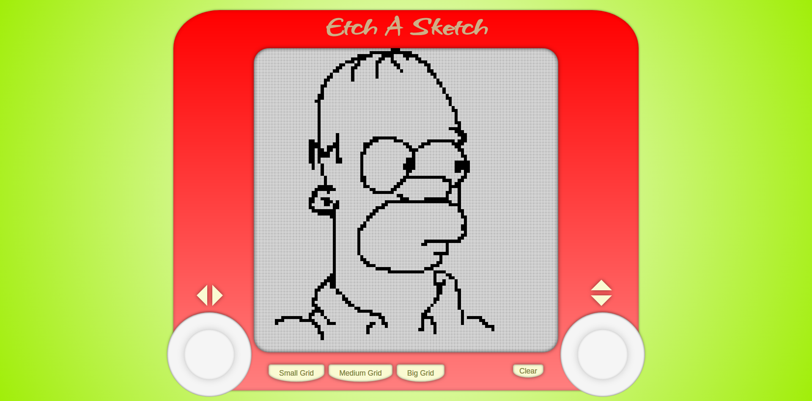
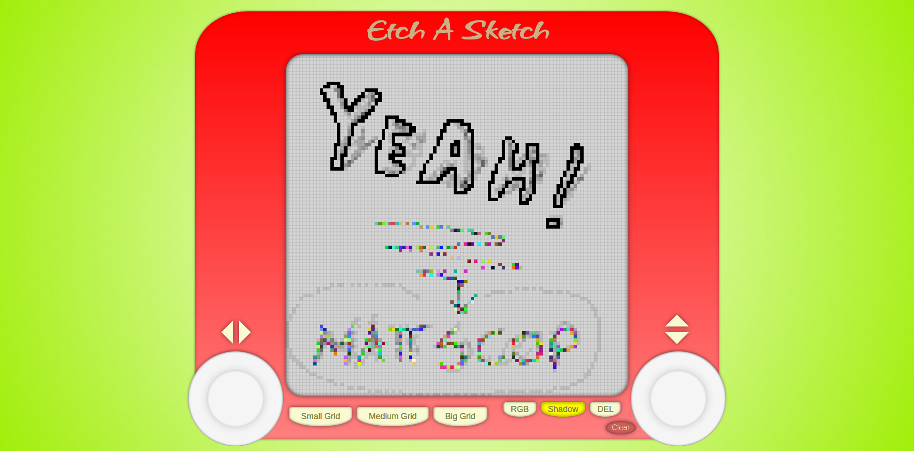

# etch-a-sketch

**Etch-A-Sketch project from The Odin Project**

**UPDATE #1**
Project is completed. I am going to add a little bit of creativity on it!

**UPDATE #2**
Added style to my project. 

**UPDATE #3**
Added extra features like shadow,rgb, delete buttons

>Notes
- It is not optimized for mobile devices

>Sources
- Link to lesson [here](https://www.theodinproject.com/lessons/foundations-etch-a-sketch)

